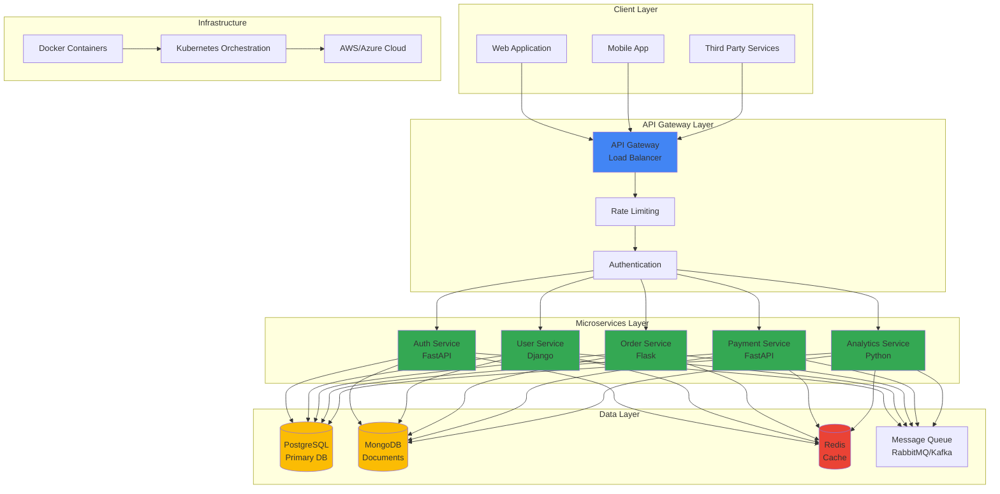
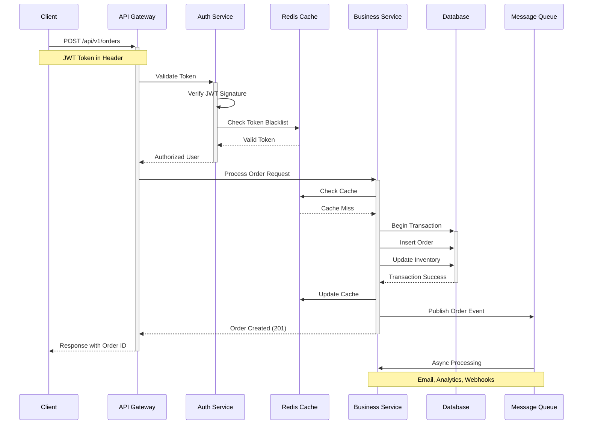
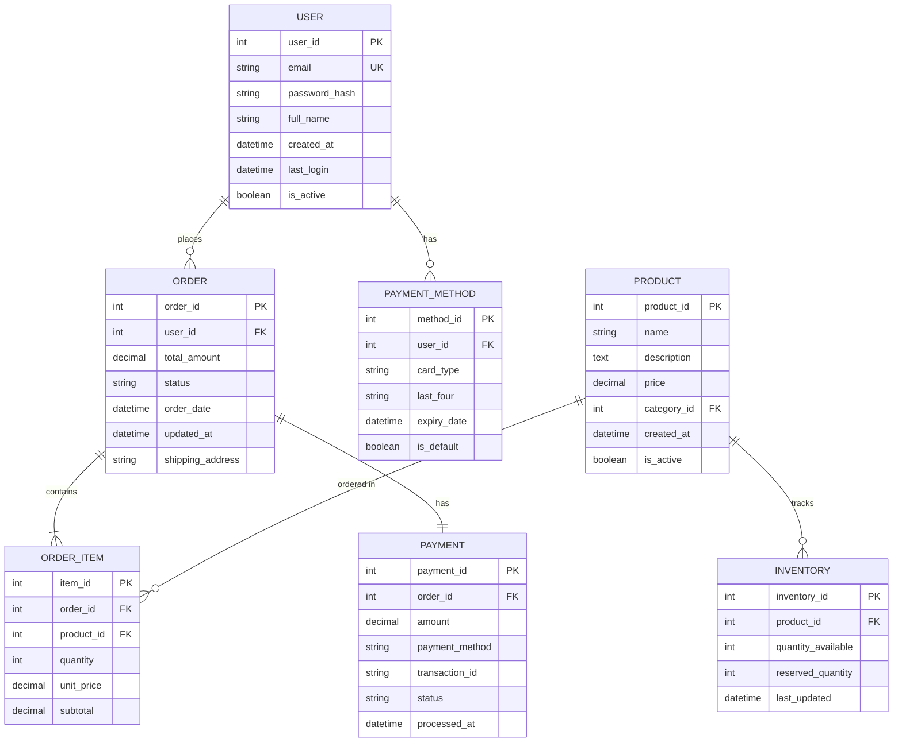
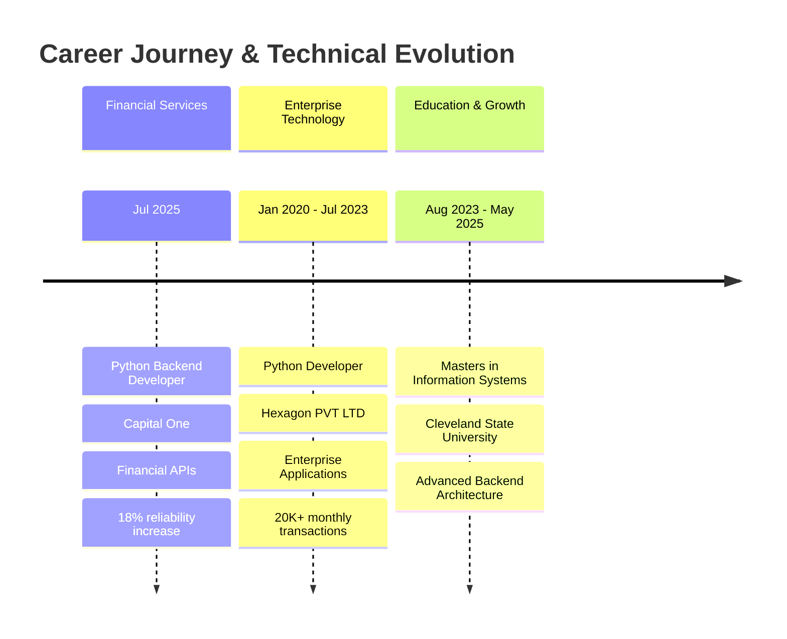
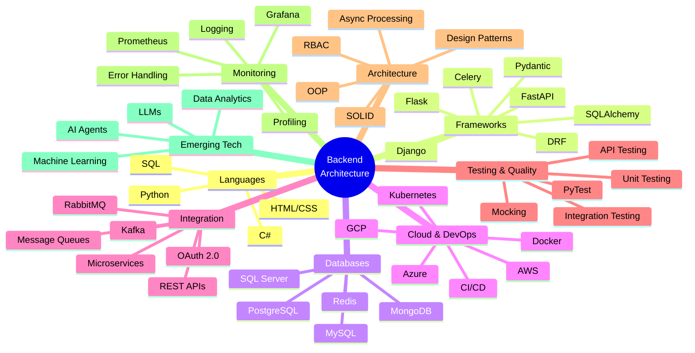

<div align="center">


[](https://www.linkedin.com/in/afsha-fathima-lnu-a29996298/)
[](mailto:fathimaafsha08@gmail.com)
[](#)
[](#)

</div>

---

## 🎯 PROFESSIONAL SUMMARY

```python
class BackendArchitect:
    def __init__(self):
        self.name = "Afsha Fathima"
        self.role = "Python Backend Developer"
        self.experience_years = 4
        self.location = "Cleveland, Ohio"
        self.specialization = [
            "REST API Development",
            "Microservices Architecture",
            "Database Optimization",
            "System Integration",
            "Performance Engineering"
        ]
    
    def current_focus(self):
        return {
            "primary": "Backend Services & API Design",
            "secondary": "Machine Learning & AI Agents",
            "tools": ["Python", "FastAPI", "Django", "SQL"],
            "impact": "Building scalable, maintainable backend systems"
        }
    
    def metrics(self):
        return {
            "api_requests_monthly": "20K+",
            "performance_improvement": "22%",
            "test_coverage": "80%",
            "reliability_increase": "18%",
            "services_integrated": "4+"
        }
```

**Python Backend Developer** with **4+ years** of experience architecting and implementing robust backend systems, REST APIs, and service integrations across **financial services** and **enterprise technology** environments. Specialized in building high-performance Python services that process **20K+ monthly transactions** with proven track record of improving backend reliability by **18%** and reducing API response times by **22%**. Expert in full-stack backend development including API design, database optimization, microservices architecture, automated testing, and production troubleshooting. Strong foundation in **Agile/Scrum** methodologies with experience delivering **2-3 releases per month** through effective collaboration with cross-functional teams.

---

## 🏗️ SYSTEM ARCHITECTURE & DESIGN

### Microservices Architecture Pattern



### API Request Flow & Security



### Database Schema Design



---

## 💼 PROFESSIONAL EXPERIENCE



### 🏦 **Capital One** — *Python Backend Developer*
**Jul 2025 - Present** | *Financial Services Technology*

**Architecture & Development:**
- Architected and developed **Python backend services** and **REST APIs** supporting critical financial application workflows, improving backend reliability by **18%** through structured validation, exception handling, and reusable service components
- Engineered **API integrations** across **4+ internal services**, processing **15K-20K requests per month** with consistent request validation, response handling, and service-to-service communication
- Refactored reusable Python modules using **OOP**, **SOLID principles**, and modular design, reducing duplicated backend logic by **15%** and simplifying recurring feature enhancements

**Performance & Optimization:**
- Optimized backend processing and database interactions for frequently used workflows, reducing average API response time by **22%** through query improvements and efficient application logic
- Implemented caching strategies and asynchronous processing patterns to handle peak loads during financial transaction periods

**Quality & Testing:**
- Developed comprehensive **PyTest** unit and integration tests for backend components and API endpoints, increasing automated test coverage to **80%** and reducing regression defects across application releases
- Established testing standards and best practices for backend service validation

**Operations & Collaboration:**
- Diagnosed and resolved **8-12 production issues per month** using application logs, debugging, exception analysis, and root-cause investigation, maintaining stable backend service operations
- Collaborated with QA, DevOps, product, and engineering teams across **2-week Agile sprints**, contributing to **2-3 backend releases per month** through development, code reviews, testing, and deployment support

**Technologies:** `Python` `FastAPI` `Django` `REST APIs` `PostgreSQL` `Redis` `PyTest` `Docker` `AWS` `CI/CD` `Git` `Agile/Scrum`

---

### 🔷 **Hexagon PVT LTD** — *Python Developer*
**Jan 2020 - Jul 2023** | *Enterprise Application Development*

**Backend Development:**
- Developed Python backend components for enterprise applications supporting **20K+ monthly data transactions**, implementing business logic and reusable services for core application workflows
- Designed and enhanced **REST APIs** for internal application integrations, handling **5K-8K API requests per month** while improving API-related defect rates by **18%**

**Database & Performance:**
- Optimized database access and SQL-based data retrieval for frequently executed backend operations, reducing query execution time by **20%** through improved queries and data-access logic
- Implemented database connection pooling and query optimization techniques for high-volume operations

**Code Quality & Maintenance:**
- Refactored **15+ reusable Python modules** using object-oriented and modular design practices, reducing code duplication by **17%** and improving maintainability across application components
- Created unit and integration tests for backend services and API functionality, achieving **78% test coverage** across assigned modules

**Production Support:**
- Investigated and resolved **10-15 application, API, and database defects per month**, using logs, debugging, and root-cause analysis to reduce recurring backend issues by **15%**
- Supported **2-3 application releases per month**, performing backend validation and coordinating with QA and technical teams to reduce post-release defects by **18%**

**Team Collaboration:**
- Participated in code reviews and Agile development activities within a **6-8 member development team**, contributing implementation feedback, technical documentation, and backend troubleshooting support

**Technologies:** `Python` `Flask` `Django REST Framework` `SQL Server` `MySQL` `MongoDB` `Git` `Jenkins` `Linux` `Agile`

---

## 🛠️ COMPREHENSIVE TECHNOLOGY STACK



### 🎨 **Frontend Technologies**

<div align="center">


</div>

**Skills:** Responsive Design • UI Components • API Integration • Form Validation

---

### ⚙️ **Backend & API Development**

<div align="center">


</div>

**Core Competencies:**
- **REST API Development** — Design, implementation, versioning, documentation
- **Microservices Architecture** — Service decomposition, inter-service communication
- **Business Logic Implementation** — Domain modeling, validation, workflow orchestration
- **API Integration** — Third-party services, webhooks, event-driven architecture
- **Asynchronous Processing** — Celery, background tasks, message queues
- **Authentication & Authorization** — OAuth 2.0, JWT, RBAC, API security
- **OOP & Design Patterns** — SOLID principles, factory, repository, singleton patterns

---

### 🗄️ **Database & Data Management**

<div align="center">


</div>

**Expertise:**
- **Relational Databases** — PostgreSQL, MySQL, SQL Server
- **NoSQL Databases** — MongoDB (document store), Redis (caching)
- **Database Design** — Schema design, normalization, indexing strategies
- **Query Optimization** — Execution plans, index tuning, query refactoring
- **ORM Frameworks** — SQLAlchemy, Django ORM
- **Data Modeling** — ER diagrams, relationship mapping